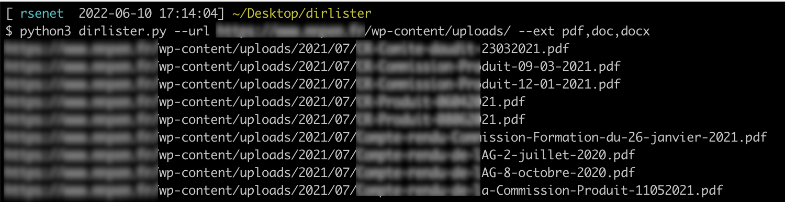

# About dirLister

**dirLister** was written in order to help any penetration testers to quickly identify all files within a Directory Listing Vulnerability on WordPress.

More information regarding Directory Listing Vulnerability: https://cwe.mitre.org/data/definitions/548.html

## Usage

Print the help to get all necessary information

```bash
$ python3 dirlister.py -h
usage: dirlister.py [-h] [--url URL] [--ext EXT] [--log LOG]

Script to quickly scrap directory listing

optional arguments:
  -h, --help  show this help message and exit
  --url URL   Specify the URL to parse
  --ext EXT   Specify extension(s) to search (pdf,png,css,etc.)
  --log LOG   Specify output log file
```





## Author

Régis SENET ([rsenet](https://github.com/rsenet))


## Contributing

Bug reports and pull requests are welcome on [GitHub](https://github.com/rsenet/dirlister).

## License

The project is available as open source under the terms of the [GPLv3](https://www.gnu.org/licenses/quick-guide-gplv3.en.html)
